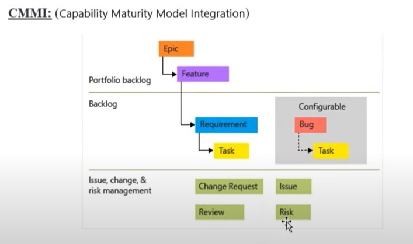

## azure board notes

* azure board is project management tool similar to __jira__

### what we acheive

* Schedule and track your tasks and issues with Azure Boards
* Work with software developers to build applications with source control management tools like Azure Repos
* Set up continuous integration and deployment with Azure Pipelines
* Create, organize, and share packages with Azure Artifacts
* Test applications end to end using Azure Test Plans
* 

* 

* 

* 

* 
