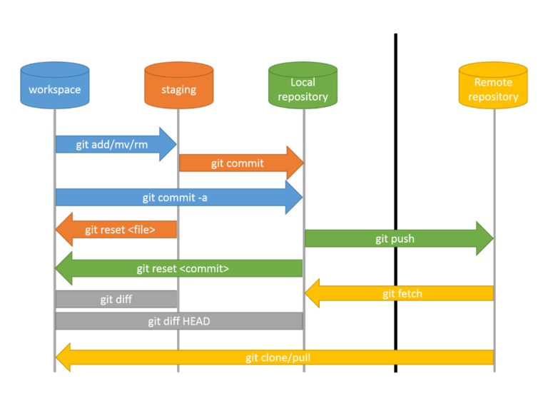

## azure repos notes

* Azure Repo purpose is __ to provide "git remote repository purpsoe__

* Before know/learna about __git__, the person has to know about __git__ otherwise the purpose azure repository can not understand

## git concepts

* git  is __distrubuted version control system__ for version of source code. 
   * souce code meaning is that , what ever __developer__ write the code by using programming language__. it is called to source code.
* Before __git__, there is __SVN__ tool.
   * it is old tool, all compaines are migrated from __SVN__ to __GIT__. No need learn single information about __SVN__

* before start work with __git__ has to install in our workstation( in our laptop).
  

* first we need to know __areas in git__

* 

* In the local repo or local system which represents a developer’s system, We have three areas
  * __Working Tree/working directory__: This is where we make changes
  * ___Staging area__: This is intermediate area before sending changes to local repo
  * __Local Repository__: Once the change is in local repo it will have history

* the 4 th one : __git remote repositoryy__.
  * it may be __github__ or __bitbucket__ or __gitlab__ or __Azure Repos__ or any other etc

* in this file, I am covring basic of git ,  which we need to lean razure devops

* for detail learning go through the below youtube playlist [check here](https://www.youtube.com/watch?v=_be8L71MF58&list=PLQ0t4AtIOGpreAc397qiuApK22xaCIQfH)

* git notes detailed documentaion is availbale [here](https://www.preethi-devops.com/git-lab-exercises)

*  __branch__: it  is a separate version of your code repository. This represents a separated line of development. To modify the codebase, you should create a branch and work from there in isolation until you are ready to merge your changes.

* __commit__: it is a way to create a snapshot. It records the changes in the branch.
* __Cloning__ it  is the act of downloading the contents of a repository from a remote server.
* __pull__: it is the process of downloading changes that don't exist on your machine from a remote repository.
* __Push__: it  is the process of adding your local changes to a remote repository.
* __merge__: to merge . one branch code into another branch__
* __tag__:

* 

